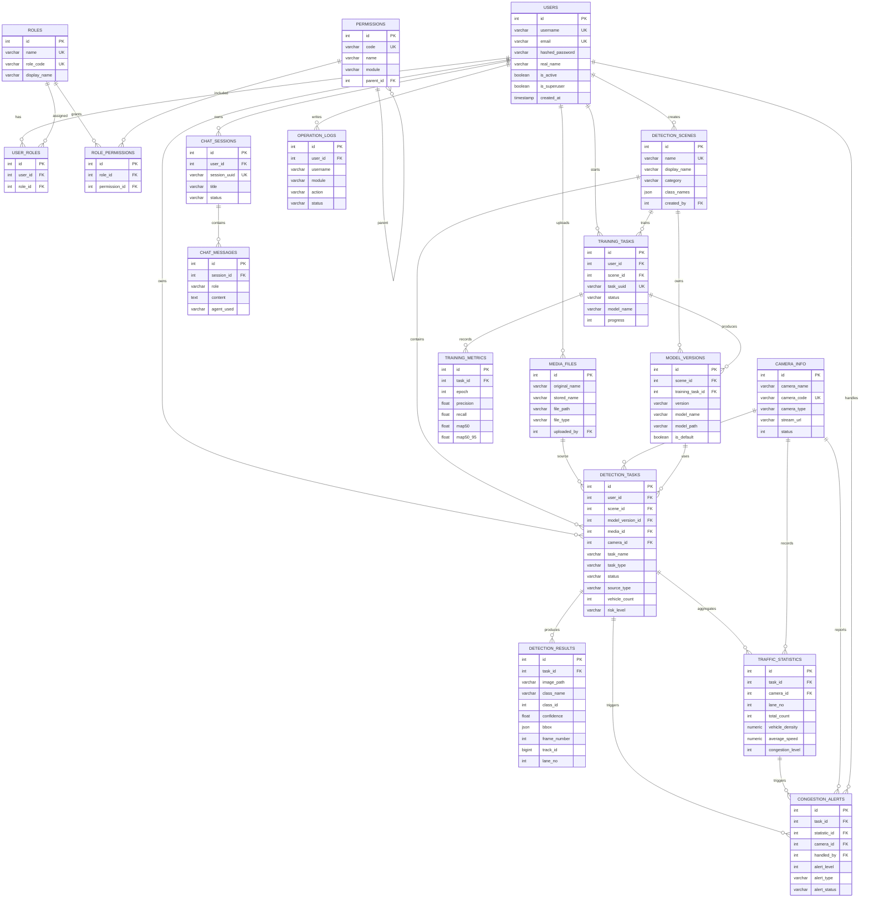

# 数据库表结构与 ER 图

检查时间：2026-07-20  
数据库：PostgreSQL `rsod_agent`  
Schema：`public`

## 表清单

| 表名 | 当前行数 | 说明 |
| --- | ---: | --- |
| `users` | 3 | 用户账号 |
| `roles` | 0 | 角色 |
| `permissions` | 0 | 权限 |
| `user_roles` | 0 | 用户-角色关联 |
| `role_permissions` | 0 | 角色-权限关联 |
| `detection_scenes` | 1 | 检测场景配置 |
| `media_files` | 0 | 上传图片/视频元数据 |
| `camera_info` | 0 | 摄像头/视频流配置 |
| `detection_tasks` | 48 | 检测任务 |
| `detection_results` | 23993 | 检测结果明细 |
| `traffic_statistics` | 0 | 交通统计聚合 |
| `congestion_alerts` | 23 | 拥堵/异常告警 |
| `training_tasks` | 0 | 训练任务 |
| `training_metrics` | 0 | 训练指标 |
| `model_versions` | 0 | 模型版本 |
| `chat_sessions` | 0 | 智能体聊天会话 |
| `chat_messages` | 0 | 智能体聊天消息 |
| `operation_logs` | 0 | 操作日志 |

## 业务分组

### 用户与权限

| 表名 | 主键 | 关键字段 | 外键 |
| --- | --- | --- | --- |
| `users` | `id` | `username`, `email`, `hashed_password`, `real_name`, `is_active`, `is_superuser` | - |
| `roles` | `id` | `name`, `display_name`, `role_code`, `is_system` | - |
| `permissions` | `id` | `code`, `name`, `module`, `permission_type`, `route_path` | `parent_id -> permissions.id` |
| `user_roles` | `id` | `user_id`, `role_id` | `user_id -> users.id`, `role_id -> roles.id` |
| `role_permissions` | `id` | `role_id`, `permission_id` | `role_id -> roles.id`, `permission_id -> permissions.id` |

### 检测与交通业务

| 表名 | 主键 | 关键字段 | 外键 |
| --- | --- | --- | --- |
| `detection_scenes` | `id` | `name`, `display_name`, `category`, `class_names`, `is_active` | `created_by -> users.id` |
| `media_files` | `id` | `original_name`, `stored_name`, `file_path`, `file_type`, `uploaded_at` | `uploaded_by -> users.id` |
| `camera_info` | `id` | `camera_name`, `camera_code`, `camera_type`, `stream_url`, `status` | - |
| `detection_tasks` | `id` | `task_name`, `task_type`, `status`, `source_type`, `total_objects`, `vehicle_count`, `risk_level` | `user_id -> users.id`, `scene_id -> detection_scenes.id`, `model_version_id -> model_versions.id`, `media_id -> media_files.id`, `camera_id -> camera_info.id` |
| `detection_results` | `id` | `class_name`, `class_id`, `confidence`, `bbox`, `frame_number`, `track_id`, `lane_no`, `speed` | `task_id -> detection_tasks.id` |
| `traffic_statistics` | `id` | `lane_no`, `statistic_time`, `total_count`, `vehicle_density`, `average_speed`, `traffic_flow`, `congestion_level` | `task_id -> detection_tasks.id`, `camera_id -> camera_info.id` |
| `congestion_alerts` | `id` | `alert_level`, `alert_type`, `alert_message`, `alert_status`, `alert_time` | `task_id -> detection_tasks.id`, `statistic_id -> traffic_statistics.id`, `camera_id -> camera_info.id`, `handled_by -> users.id` |

### 训练与模型

| 表名 | 主键 | 关键字段 | 外键 |
| --- | --- | --- | --- |
| `training_tasks` | `id` | `task_uuid`, `status`, `model_name`, `epochs`, `progress`, `dataset_path` | `user_id -> users.id`, `scene_id -> detection_scenes.id` |
| `training_metrics` | `id` | `epoch`, `box_loss`, `cls_loss`, `precision`, `recall`, `map50`, `map50_95` | `task_id -> training_tasks.id` |
| `model_versions` | `id` | `version`, `model_name`, `model_type`, `model_path`, `class_names`, `is_default` | `scene_id -> detection_scenes.id`, `training_task_id -> training_tasks.id` |

### 智能体与审计

| 表名 | 主键 | 关键字段 | 外键 |
| --- | --- | --- | --- |
| `chat_sessions` | `id` | `session_uuid`, `title`, `status`, `message_count` | `user_id -> users.id` |
| `chat_messages` | `id` | `role`, `content`, `agent_used`, `tool_calls`, `tokens_used` | `session_id -> chat_sessions.id` |
| `operation_logs` | `id` | `username`, `module`, `action`, `target_type`, `status`, `request_path` | `user_id -> users.id` |

## ER 图

## 关系摘要

- `users` 是核心用户表，关联检测任务、训练任务、聊天会话、上传文件、操作日志和告警处理人。
- `detection_tasks` 是检测业务中心表，上接用户、场景、模型、媒体/摄像头，下接检测结果、交通统计和告警。
- `detection_results` 当前数据量最大，有 23993 条，是每个检测目标的明细记录。
- `congestion_alerts` 目前有 23 条告警，可由检测任务、交通统计或摄像头关联定位。
- RBAC 表已经建好，但 `roles`、`permissions`、`user_roles`、`role_permissions` 当前为空。

